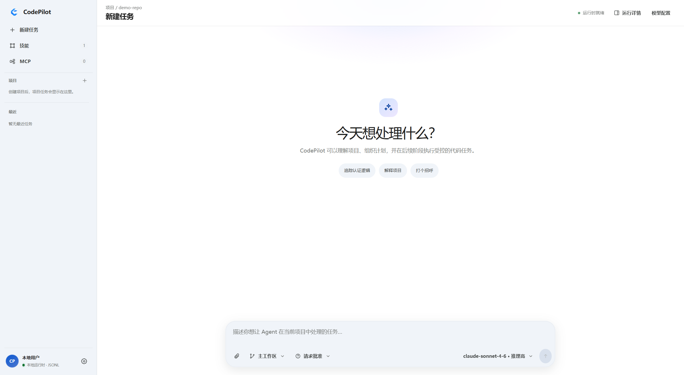
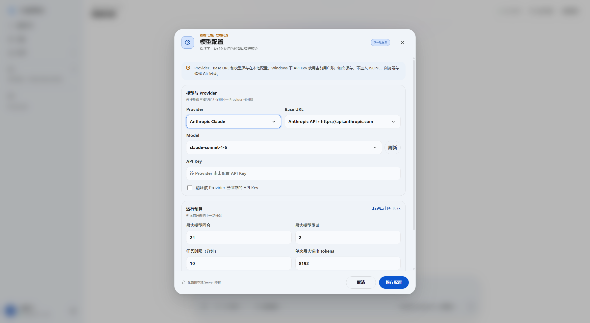
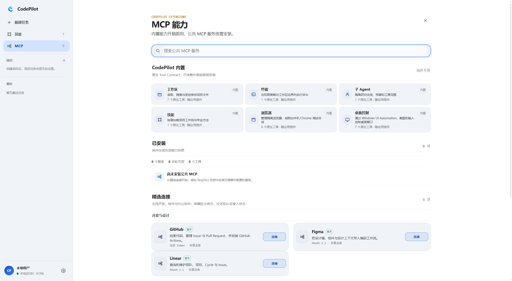
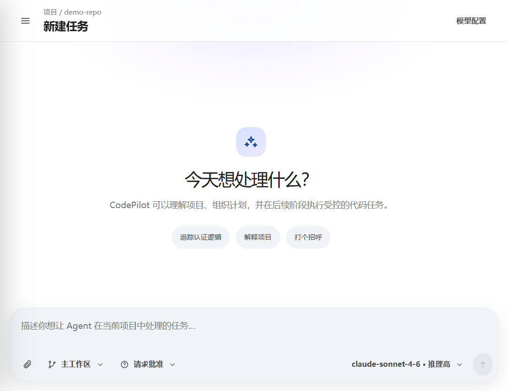
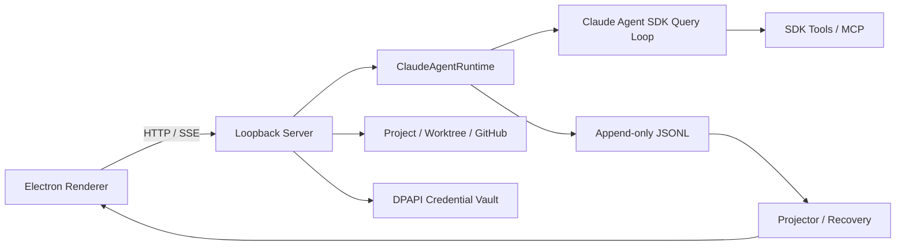

# CodePilot

> **面向 Windows 本地开发流程的可观察 Coding Agent Harness。**

[](https://github.com/Charlotte57-zhou/codepilot-harness/actions/workflows/ci.yml)
[](LICENSE)

CodePilot 不是另一层 LLM Chat，也不是 Bash 包装器。它围绕 Claude Agent SDK 的单一 Agent Loop，管理 **Project / Task / Run**、权限、JSONL 会话事实、恢复、Skills / MCP、Git Worktree、Diff / Undo 与 GitHub 交付，并在 Electron 中把 Agent 的真实执行过程呈现为可审查工作台。



## 它解决什么问题

Coding Agent 能生成代码，但团队还需要回答：它在哪个工作区执行、调用了什么工具、谁批准了高风险操作、结果能否恢复、变更能否审查和撤销。CodePilot 将这些交付控制从聊天文本提升为有状态产品能力。

| 用户问题 | CodePilot 的产品回答 |
| --- | --- |
| 多个仓库与任务如何隔离？ | Project Registry + 每个 Task 的 Git Worktree |
| 一次执行如何追踪？ | Run ID、Tool Event、Permission Event 与 Append-only JSONL |
| 中断后如何继续？ | 从 JSONL 重建 Projection，以新 Run 恢复最新 Task 与冻结偏好 |
| 如何确认 Agent 真正改了什么？ | Git Diff、Test Receipt、Undo、Push / PR |
| Key 放在哪里？ | Server / Windows DPAPI Vault；不进入 Renderer、JSONL 或 Git |

## 三分钟体验路径

1. 选择或连接一个本地 Git Project。
2. 创建隔离 Task，输入目标。
3. 观察 SDK Tool Call、权限确认与 Run 状态。
4. 在 Review 中检查 Diff，并执行 Undo 或继续 GitHub 交付。

完整讲解见 [十分钟面试演示](docs/DEMO_SCRIPT.md)。

## 产品界面

| Provider 设置 | MCP 能力目录 |
| --- | --- |
|  |  |

窄窗口同样保留核心任务流与审查能力：



> 截图来自本地 Electron 实际界面。演示内容使用仓库内 Fixture；公开导出会对截图和源码执行同一隐私检查。

## 架构



- **单一 Agent Loop：** 模型迭代由 Claude Agent SDK 负责，CodePilot 不维护第二套推理循环。
- **明确状态所有权：** Server / Runtime 写入事实；Renderer 只消费 DTO 和派生视图。
- **可恢复：** JSONL 是 Session 事实源，Snapshot / Projection 可重建。
- **可逆交付：** Git Worktree、Diff、Undo、Push 与 PR 位于同一 Task 流程。
- **边界诚实：** Workspace Path Guard 不等于 OS Sandbox；Bash 仍使用当前用户权限。

详见 [系统架构](docs/ARCHITECTURE.md) 与 [Bash 安全边界](docs/bash-security-boundary.md)。

## 快速开始

### 环境要求

- Windows 10 / 11
- Node.js 22+
- Git
- 可选：GitHub CLI（用于连接仓库、Push 和创建 PR）

```powershell
git clone https://github.com/Charlotte57-zhou/codepilot-harness.git
cd codepilot-harness
npm ci
npm run desktop
```

Provider Key 在应用设置中写入本地 Vault。需要使用进程环境变量进行 Server 开发时，参考 [`.env.example`](.env.example)；应用不会自动加载该文件。

### 常用命令

```powershell
npm test
npm run check:context
npm run check:privacy
npm run export:public -- --output <EMPTY_DIR>
npm run verify:public -- --input <PUBLIC_DIR>
npm run package:win
```

完整发布标准见 [质量门禁](docs/QUALITY_GATES.md)。

## v0.1 范围与限制

- 仅发布本地 Electron 版本；不包含 Hosted / Vercel Edition。
- Windows 优先，公开 Binary 未签名。
- Anthropic、DeepSeek、Moonshot 是当前公开 Provider Profile；真实 Credential Smoke 不属于已提交的干净发布证据。
- Bash Permission 是审批与审计机制，不是进程级隔离。
- Skills、MCP、Session Recovery 与成熟 Coding Agent 相比为部分对齐；Subagent 与完整 Hook 生态未对齐。
- v0.1 采用当前 Schema 的 Breaking Contract，不保留预发布兼容分支。

## 文档

- [产品定义](PRODUCT.md)
- [交互与视觉设计](DESIGN.md)
- [文档导航](docs/README.md)
- [Provider 兼容性](docs/PROVIDER_COMPATIBILITY.md)
- [Claude Agent SDK 对齐情况](docs/CLAUDE_AGENT_SDK_ALIGNMENT.md)
- [贡献指南](CONTRIBUTING.md)
- [安全策略](SECURITY.md)
- [Roadmap](ROADMAP.md)

## 许可证

CodePilot 以 [Apache License 2.0](LICENSE) 开源。第三方依赖与参考边界见 [THIRD_PARTY_NOTICES.md](THIRD_PARTY_NOTICES.md)。
