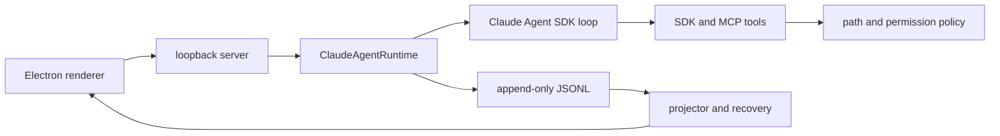

# CodePilot

**A local, observable coding-agent harness for Windows.** CodePilot turns the Claude Agent SDK into a product workflow with explicit Project / Task / Run ownership, permission decisions, durable JSONL transcripts, restart recovery, Git worktrees, Skills/MCP integration, diff review, undo, and an Electron workbench.

CodePilot is not an LLM chat shell and does not claim feature parity with Claude Code or Codex. The SDK is the only agent loop; CodePilot owns the local control plane around it.

## What the demo proves

1. Open a real Git project or the bundled fixture.
2. Create an isolated Task backed by a Git worktree.
3. Ask the agent to inspect and change code.
4. Observe tool calls, approve a sensitive action, and inspect the live task/run trace.
5. Review the generated diff, undo it, then resume the interrupted run from durable events.

The strongest evidence is the end-to-end state flow, not a scripted answer:



## Scope and boundaries

- **Local-first:** Electron plus a loopback Node server; no hosted interview edition is included.
- **Windows-first:** the release artifact is an unsigned portable Windows executable.
- **Provider scope:** Anthropic, DeepSeek, and Moonshot profiles; `fake` is retained only for deterministic local tests/demo.
- **Current schema only:** v0.1.0 intentionally removes application-owned migration and legacy projection paths. Older CodePilot runtime state is not imported.
- **Security boundary:** API keys stay in the server-side credential vault and are not returned to the renderer or written to JSONL. Workspace path guards are not an OS sandbox. Bash runs with the user's OS authority after CodePilot's permission decision.
- **Comparison language:** capabilities are documented only as aligned, partially aligned, or not aligned in [SDK alignment](docs/CLAUDE_AGENT_SDK_ALIGNMENT.md).

## Quick start

Requirements: Windows 10/11, Node.js 22+, npm, Git. GitHub CLI is optional for repository/PR actions.

```powershell
git clone https://github.com/Charlotte57-zhou/codepilot-harness.git
cd codepilot-harness
npm ci
npm test
npm run desktop
```

The app starts without a provider key by using the deterministic `fake` runtime. For a real provider, open **Settings -> Model provider** and save the credential in the local vault. `.env.example` documents process-level variables for server-only development; the project does not auto-load `.env` files.

## Commands

| Command | Purpose |
| --- | --- |
| `npm run desktop` | Start the Electron workbench |
| `npm run dev` | Start the loopback server only |
| `npm test` | Run the root test suite |
| `npm run check:context` | Validate Markdown links/current claims |
| `npm run check:privacy` | Scan the exact public allowlist |
| `npm run export:public` | Build a clean source export plus manifest |
| `npm run verify:public -- --input <DIR>` | Re-hash and privacy-check an export |
| `npm run package:win` | Build the unsigned portable Windows artifact |
| `npm run ui:capture` | Capture deterministic desktop visual evidence |

## Architecture and evidence

- [Product scope](PRODUCT.md)
- [Design decisions](DESIGN.md)
- [Architecture and state ownership](docs/ARCHITECTURE.md)
- [Quality gates](docs/QUALITY_GATES.md)
- [10-minute demo script](docs/DEMO_SCRIPT.md)
- [Provider compatibility](docs/PROVIDER_COMPATIBILITY.md)
- [Security policy](SECURITY.md)
- [Contributing](CONTRIBUTING.md)

## Release status

v0.1.0 is an interview-quality local reference implementation, not a production multi-tenant service. The public export is generated from an explicit allowlist, scanned for secrets and local paths, initialized as a fresh one-commit repository, and distributed under Apache-2.0. See [CHANGELOG](CHANGELOG.md) and [Roadmap](ROADMAP.md).

## License and trademarks

Code is licensed under the [Apache License 2.0](LICENSE). Third-party dependencies and product references retain their respective licenses and trademarks; see [THIRD_PARTY_NOTICES.md](THIRD_PARTY_NOTICES.md).
