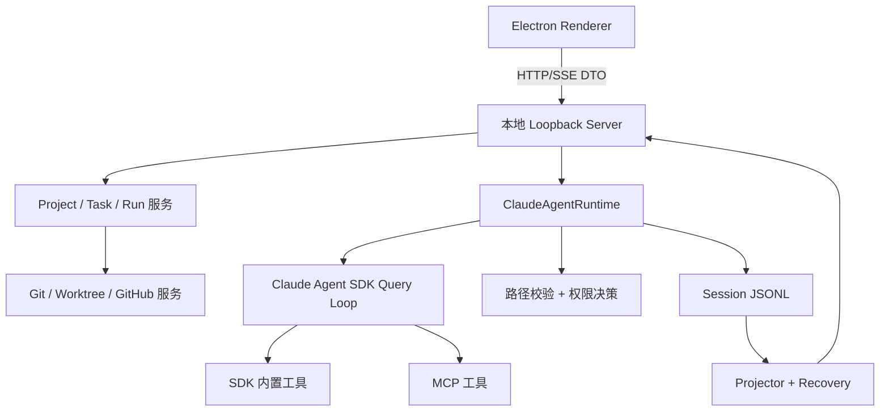

# 系统架构

## 决策摘要

CodePilot 是围绕 Claude Agent SDK 构建的单用户、本地控制平面。系统明确划分状态所有权，使界面能够解释、恢复和撤销 Agent 工作，而不是在 Renderer 中推测事实。

## 状态所有权

| 事实 | 所有者 | 持久化来源 |
| --- | --- | --- |
| Project 与 WorkspaceTarget | Project Registry | 当前 Schema 的 Registry JSON |
| Task 目标与目标工作区 | Session Store | Session Metadata + JSONL |
| Run 生命周期与运行选项 | Runtime / Session Store | Run 级 JSONL 事件 |
| 模型与工具调用记录 | Runtime | Append-only JSONL |
| UI 中的 Task / Run 视图 | Projector | 可重建的派生状态 |
| Provider Secret | Credential Vault | OS 保护的 Server 侧文件 |
| 源码变更 | Git / Worktree | 仓库文件系统与 Git |

## 一次 Run 的端到端数据流

1. Renderer 请求 Server 为某个 Task 和 WorkspaceTarget 创建 Run。
2. Server 解析目标根目录，并冻结 Provider、Model、Permission Mode、Skill/MCP 能力快照与 Run ID。
3. `ClaudeAgentRuntime` 调用 SDK Query Loop；CodePilot 不再实现第二套模型推理循环。
4. SDK 文件系统工具进入权限执行前，CodePilot 先把路径规范化到目标根目录下；目录穿越、绝对路径逃逸和符号链接逃逸会被拒绝。
5. 权限请求与决策都写入 Run 事件。Bash 受工作目录和权限策略约束，但不被表述为 OS Sandbox。
6. Tool Call / Tool Result 携带 Run ID 与持久 Batch ID；每个调用必须得到且只得到一条结果或修复事件。
7. 事件追加到 JSONL，Projector 再通过 Server Stream 更新 Renderer。
8. 终态只来自 `run_state_changed`；内容事件本身不推断 Run 已完成。

## 失败与恢复

- **取消：** Abort Signal 传递到 Runtime，尚未闭合的 Tool Call 会记录真实终态。
- **进程中断：** Recovery 读取 JSONL，只为缺失结果的 Tool Call 补充带原始 Run ID 的修复记录，然后重建投影。
- **恢复执行：** Server 读取最新 Task Prompt 和最近一次冻结的运行偏好，并创建新的 Run ID。
- **当前状态无效：** 过期或缺失的 WorkspaceTarget、Run ID、Batch ID，以及不完整的 Tool Result Contract 会显式报错，不回退到旧版推断路径。
- **Provider / MCP 错误：** 错误归属到当前 Run 并保留审计记录；Secret 在持久化和进入 UI 前脱敏。

## 信任边界

信任层级为 Renderer < Loopback Server < Provider / MCP / GitHub / OS。本地 API 假设调用者是同一受信任的本机用户。路径守卫约束 CodePilot 文件工具，但不约束任意子进程。JSONL 可能包含 Prompt 和源码片段，因此属于敏感的本地数据。

## 模块地图

- `server.mjs`：Loopback API、Streaming 与模块组装。
- `desktop/`：Electron 生命周期、Project Registry、Worktree、Git/GitHub 与 Vault 集成。
- `src/claude-agent-runtime.mjs`：SDK 生命周期、事件标准化和 Permission Hook。
- `src/session-store.mjs`、`src/transcript-projector.mjs`、`src/session-recovery.mjs`：事实源、投影、重建与恢复。
- `src/sdk-built-in-tool-policy.mjs`：文件系统参数和 Workspace Root 约束。
- `public/`：Renderer 和纯 View Model 模块。
- `tests/`：单元、集成与进程级验证证据。
