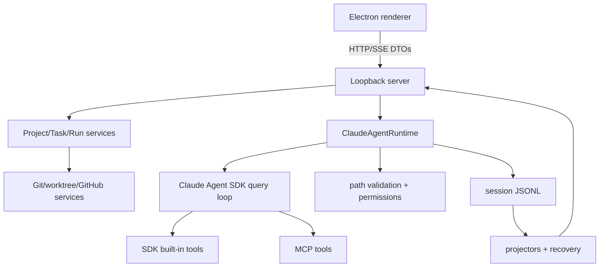

# Architecture

## Executive view

CodePilot is a single-user local control plane around the Claude Agent SDK. State ownership is explicit so the interface can explain, resume, and reverse agent work without inventing facts in the renderer.

## State owners

| Fact | Owner | Durable source |
| --- | --- | --- |
| project and workspace targets | project registry | current-schema registry JSON |
| task objective/target | session store | session metadata + JSONL |
| run lifecycle/options | runtime/session store | run-scoped JSONL events |
| model/tool transcript | runtime | append-only JSONL |
| UI task/run view | projector | derived, rebuildable |
| provider secret | credential vault | OS-protected server-side file |
| source changes | Git/worktree | repository filesystem/Git |

## End-to-end run

1. Renderer asks the server to create a run for a Task and WorkspaceTarget.
2. Server resolves the target root and freezes provider, model, permission mode, Skill/MCP capability snapshot, and run ID.
3. `ClaudeAgentRuntime` calls the SDK query loop. There is no CodePilot-authored second reasoning loop.
4. Before an SDK filesystem tool reaches permission execution, CodePilot canonicalizes its path under the target root. Traversal, absolute escape, and symlink escape are denied.
5. Permission requests and decisions are run events. Bash uses cwd plus permission policy; it is not presented as OS isolation.
6. Tool calls/results have run ID and durable batch ID. Each call receives exactly one recorded result or repair event.
7. Events append to JSONL, then projectors update the renderer through the server stream.
8. Terminal state comes from `run_state_changed`; content events alone do not infer completion.

## Failure and recovery

- **Cancellation:** abort signal reaches the runtime; pending tool calls are closed with real terminal records.
- **Process interruption:** recovery reads JSONL, repairs only incomplete tool-call pairs with the originating run ID, and reconstructs projections.
- **Resume:** the server restores the latest task prompt plus the most recent frozen run preferences and creates a new run ID.
- **Invalid current state:** old/missing WorkspaceTarget, run ID, batch ID, or explicit tool-result contracts fail with diagnostics instead of legacy inference.
- **Provider/MCP error:** failure is recorded on the run and remains auditable; secrets are redacted before persistence/UI.

## Trust boundaries

Renderer < loopback server < provider/MCP/GitHub/OS. The loopback API assumes the same trusted local user. Path guards constrain CodePilot filesystem tools but do not constrain arbitrary child processes. JSONL can include prompts and source fragments and is sensitive local data.

## Module map

- `server.mjs`: loopback API, streaming, composition.
- `desktop/`: Electron lifecycle, project registry, worktrees, Git/GitHub, vault integration.
- `src/claude-agent-runtime.mjs`: SDK lifecycle, event normalization, permission hook.
- `src/session-store.mjs`, `src/transcript-projector.mjs`, `src/session-recovery.mjs`: fact source and rebuild/recovery.
- `src/sdk-built-in-tool-policy.mjs`: filesystem arguments and workspace-root enforcement.
- `public/`: renderer and pure view-model modules.
- `tests/`: unit and process-level integration evidence.
